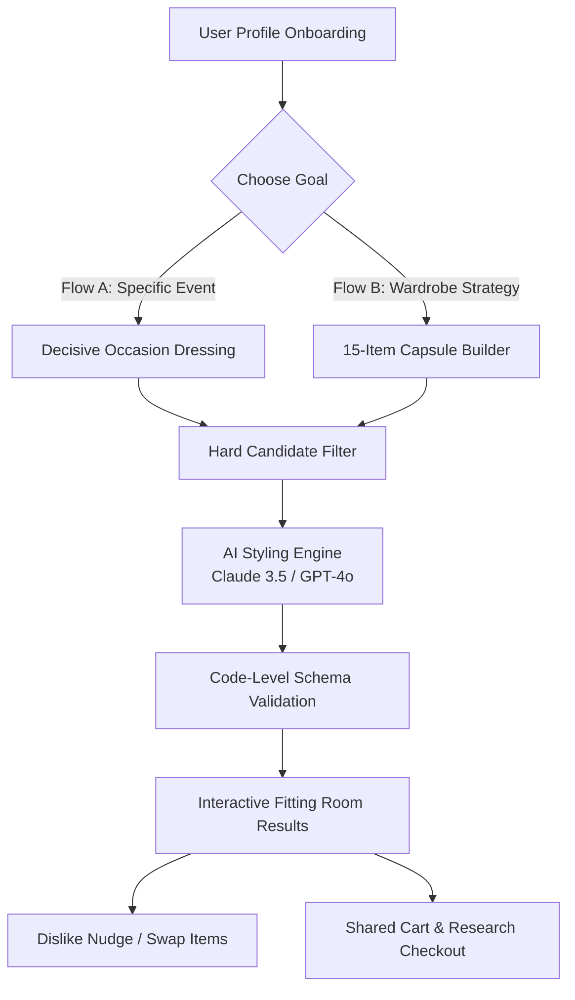
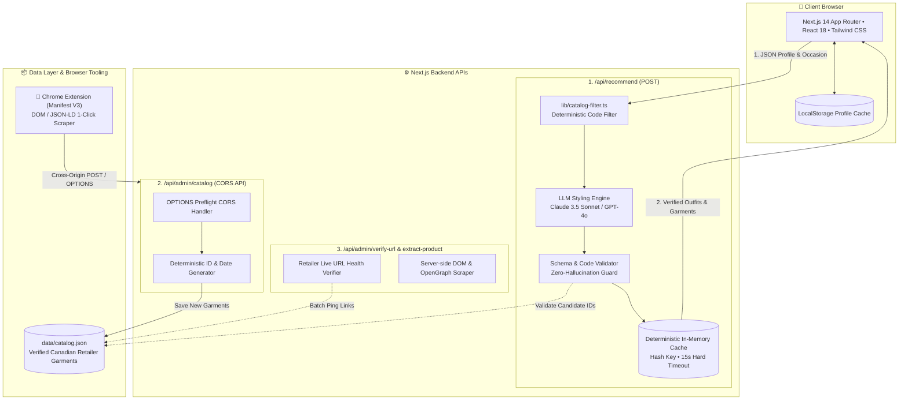

# Style Advisor — Product Requirements Document (PRD)

> **"Gain confidence with your style advisor. Remove the guesswork."**

---

## 1. Executive Summary & Vision

**Style Advisor** is an AI-powered styling intelligence and capsule wardrobe curation platform tailored for the modern individual and calibrated for Canadian and global climates. Unlike traditional e-commerce aggregators that overwhelm shoppers with endless catalogs or generic AI chat interfaces prone to hallucinating non-existent items, Style Advisor operates on a strict **Zero-Hallucination Architecture**:

> *"The AI is allowed to have taste, but not facts."*

By decoupling deterministic catalog validation from generative aesthetic reasoning, Style Advisor guarantees that every single item recommended exists, is in stock, is color-calibrated, and links directly to verified partner retailers (*Aritzia, Kotn, RW&CO, Lululemon, Vessi, etc.*).

---

## 2. Core Product Principles & Aesthetics

| Principle | Description |
| :--- | :--- |
| **Zero Hallucination** | The LLM never invents product names, prices, or links. The application hard-filters candidate garments by code, injects only verified deterministic IDs to the AI, validates the output schema, and resolves metadata from the verified local catalog. |
| **"Fitting Room" Aesthetic** | Quiet luxury visual design. Soft warm paper backgrounds (`#F7F4EF`), midnight navy ink (`#1F2A44`), thread gold accents (`#8A5A12`), and forest moss verifications (`#3F6B4F`). Serif headlines with clean sans body typography. No aggressive e-commerce dark patterns or countdown timers. |
| **Decisive Curation** | Eliminates decision fatigue. Rather than returning 50 search results, it returns either **1 Decisive Outfit** (Flow A) or a **Calibrated 15-Item Starter Capsule** (Flow B). |
| **Seamless Ingestion** | Integrated Chrome Extension (Manifest V3) and Admin Ingestion Hub allowing stylists and operators to scrape and ingest live retailer products with one click. |

---

## 3. User Personas & Core Workflows

### 3.1. Target Personas
1. **The Time-Constrained Professional (e.g., Sam - Tech Founder)**
   - *Need*: Needs a pitch-ready outfit for an investor meeting in Vancouver/Toronto that balances authority with local casual realism.
   - *Pain Point*: Hates browsing dozens of store tabs; doesn't know how to combine textures and colors for changing weather.
2. **The Intentional Capsule Builder (e.g., Maya - Creative Lead)**
   - *Need*: Wants a versatile 15-item seasonal wardrobe that mixes-and-matches seamlessly across work, travel, and casual occasions.
   - *Pain Point*: Owns disjointed pieces that don't coordinate, leading to wardrobe clutter.

---

### 3.2. Core User Flows



#### Flow A: Decisive Occasion Dressing
- **Input**: Occasion (*Pitch, Date Night, Travel, Wedding, Daily Work*), Season, Budget Tier, Color Palette, and Formality slider (1–10).
- **Output**: Exactly 1 cohesive 4-to-5 piece outfit (Top, Bottom, Shoes, Outerwear, Accessory) with editorial stylist reasoning, color harmony notes, and weather layering guidance.
- **Interactive Dislike Nudges**: Quick recalibration chips:
  - `[Too Formal]` -> Recalibrates formality down by 2 points.
  - `[Too Casual]` -> Recalibrates formality up by 2 points.
  - `[Not My Vibe]` -> Discards specific piece and draws candidate alternative.

#### Flow B: 15-Item Capsule Wardrobe Matrix
- **Input**: Primary aesthetic style, seasonal transition, and budget level.
- **Output**: 
  - **3 Worked Outfits**: Distinct ready-to-wear combinations drawn from the matrix.
  - **15-Item Interactive Grid**: (5 Tops, 4 Bottoms, 3 Outerwear, 2 Shoes, 1 Accessory).
  - **Starter Set of 5 Highlights**: The essential foundation pieces to purchase first.
  - **"I Already Have This" Feature**: Allows users to mark owned items, triggering asymmetric matrix replenishment.

---

## 4. System Architecture & Technical Stack



### 4.1. Technology Stack
- **Framework**: Next.js 14.2.15 (App Router, Server Actions, API Routes)
- **Frontend**: React 18, Tailwind CSS, Lucide React, Google Serif/Sans Fonts
- **Language**: TypeScript 5.6 (Strict Type Safety)
- **AI Inference**: Anthropic Claude 3.5 Sonnet / OpenAI GPT-4o (Structured JSON Mode)
- **Storage**: Deterministic JSON Catalog (`data/catalog.json`) + Client LocalStorage
- **Containerization**: Docker (Alpine Node 20) + Docker Compose
- **Browser Extension**: Chrome Extension Manifest V3 (Vanilla JS, CSS, JSON-LD Extractor)

---

## 5. Catalog Schema & Garment Data Model

Each item in `data/catalog.json` adheres strictly to the `Garment` TypeScript interface in `types/catalog.ts`:

```typescript
export interface Garment {
  id: string;                          // Deterministic ID (e.g. ca_aritzia_effortless-pant_7a2f)
  name: string;                        // Full product name
  brand: string;                       // Canadian / Global Partner Brand
  slot: "top" | "bottom" | "outerwear" | "shoes" | "accessory";
  price: number;                       // CAD value
  currency: string;                    // "CAD"
  product_url: string;                 // Direct retailer URL
  image_url: string;                   // CDN product image link
  gender_cut: "men" | "women" | "unisex";
  budget_tier: "budget" | "mid" | "luxury";
  occasions: Occasion[];               // ["work", "pitch", "casual", "date_night", ...]
  palette_seasons: PaletteSeason[];    // ["autumn", "winter", "spring", "summer", ...]
  body_types: BodyType[];              // ["slim", "athletic", "average", "tall", ...]
  season_of_wear: SeasonOfWear[];      // ["fall", "spring", "winter", "all-season"]
  formality_score: number;             // Scale 1 to 10
  color: string;                       // "Birch White", "Classic Navy", "Dark Olive"
  hex_color: string;                   // Hex code swatch (#1F2A44)
  fabric: {
    composition: string;               // "100% Japanese Crepe Polyester"
    care: string;                      // "Machine wash cold. Hang dry."
    sustainable?: boolean;
  };
  return_policy: {
    window_days: number;               // 30
    free_returns: boolean;
    policy_note?: string;
  };
  description?: string;
  styling_notes?: string;
  in_stock: boolean;
  verified_date?: string;              // "YYYY-MM-DD"
}
```

---

## 6. Admin Inventory & Chrome Extension Ingestion Hub

### 6.1. Admin Management Dashboard (`/admin`)
- **Real-Time URL Health Monitor**: Batch pings all retailer links to detect 404s, out-of-stock items, or WAF challenges with latency metrics.
- **Garment Modal Editor**: Add, edit, clone, or delete items with automatic slugification and image preview.
- **Smart URL Extractor**: Paste any URL (*Aritzia, Kotn, RW&CO, Lululemon, Vessi*) to auto-extract product title, price, fabric, and images.

### 6.2. Chrome Extension (`/extension`)
- Built on **Chrome Manifest V3**.
- Automatically activates on shopping product pages.
- Reads `<script type="application/ld+json">`, OpenGraph meta tags, and brand DOM trees.
- Features real-time preflight CORS health verification and 1-click push to `http://localhost:3000/api/admin/catalog`.
- Admin page listens via live auto-sync stream (polling every 4s) to prepend new items with a **`NEW INGEST`** badge.

---

## 7. Quality, Performance & Non-Functional Requirements

1. **Deterministic Latency**: API recommendation pipeline must return verified outfits in under **15 seconds**; pre-cached demo profiles in under **1.5 seconds**.
2. **0% Broken Links Guarantee**: Integrated test script `npm run verify-links` executes pre-flight checks against the entire catalog.
3. **Accessibility (WCAG 2.1 AA)**: High-contrast color ratios, keyboard navigable modals, and descriptive image alt tags with fallback badges.
4. **Resilience & Fallback**: If an LLM provider experiences timeouts or API errors, the system triggers graceful rule-based fallback styling rather than throwing UI exceptions.

---

## 8. Development Roadmap

- [x] **Phase 1: Foundation & Data Architecture** (TypeScript definitions, mock catalog, Dockerization).
- [x] **Phase 2: AI Engine & Zero-Hallucination Pipeline** (Filter logic, structured JSON schema, code validator, caching).
- [x] **Phase 3: Interactive Fitting Room UI** (Flow A Occasion View, Flow B Capsule Matrix, Shared Cart, Research Checkout).
- [x] **Phase 4: Admin Management & Chrome Extension** (CORS ingestion, link health check, Manifest V3 extension).
- [ ] **Phase 5: User Accounts & Multi-Wardrobe Synchronization** (Cloud database persistence, saved wardrobes).
- [ ] **Phase 6: Multi-Region Localization** (USD/EUR currency toggle, European and US retailer integrations).
