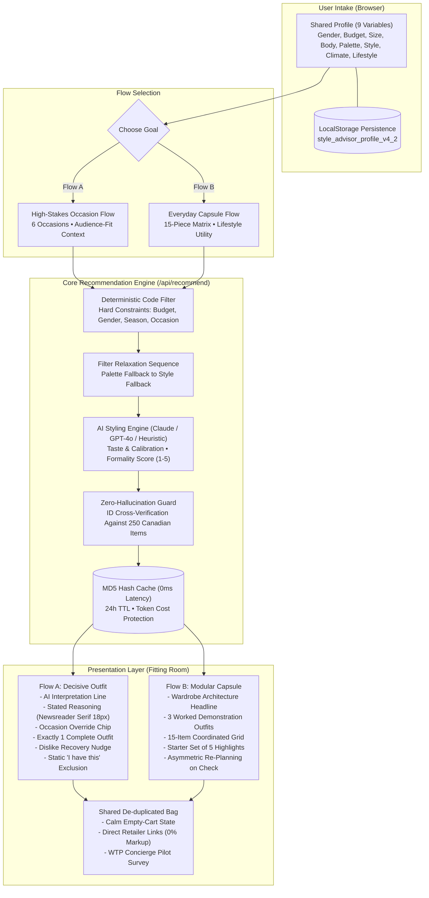

# Product Requirements Document (PRD v4.2.1)

**Product Name:** Style Advisor  
**Document Version:** 4.2.1  
**Date:** September 25, 2026  
**Status:** Engineering Ready / Actionable / Phase 1–3 Implemented  
**Target Milestone:** ProductBC Build-a-Thon Demo Day (Saturday, October 17, 2026)  

**Core Team:**
* **Zoe:** Product & Research Lead  
* **Hemnesh:** Operations & Mentor/Partner Liaison  
* **Peter:** Market Strategy & Content/Narrative Lead  
* **Jeremy:** Technical Lead & Primary Coder  

---

## 1. Document Version History

| Version | Release Date | Primary Changes & Milestones | Author / Owner |
| :--- | :--- | :--- | :--- |
| **v1.0.0** | Sep 18, 2026 | Initial MVP architecture, Next.js 14 setup, basic candidate filter prototype. | Jeremy |
| **v3.0.0** | Sep 20, 2026 | Added Chrome Extension (Manifest V3) and Admin Catalog Ingestion Hub. | Jeremy / Zoe |
| **v4.1.0** | Sep 22, 2026 | Established "Fitting Room" luxury design tokens and 2-flow architectural blueprint. | Zoe / Peter |
| **v4.2.0** | Sep 23, 2026 | Standardized 9 onboarding profile fields, 6 high-stakes occasions, occasion override chips, and WTP survey. | Entire Team |
| **v4.2.1** | Sep 25, 2026 | Expanded catalog to **250 verified Canadian garments**, completed Zero-Hallucination pipeline, MD5 0ms cache, and sub-60s onboarding. | Jeremy / Zoe |

---

## 2. Open Issues & Action Register

| Code | Issue / Open Item | Risk Level | Current State & Resolution | Status | Owner |
| :--- | :--- | :---: | :--- | :---: | :--- |
| **OPEN-1** | **Catalog Curation** | **CRITICAL** | Curated and validated **250 Canadian apparel items** across 20 domestic brands (*Aritzia, RW&CO, Lululemon, Kotn, Frank And Oak, Vessi, Canada Goose, etc.*). | **CLOSED** | Zoe / Jeremy |
| **OPEN-2** | **Persona Discrepancy** | **HIGH** | Locked pitch narrative and live demo strictly to **Sam (31, Founder pitching VCs in Gastown)** to showcase *Audience-fit*. | **CLOSED** | Peter / Jeremy |
| **OPEN-3** | **Validating Persona Sam** | **HIGH** | Executing 2–3 rapid 1:1 behavioral interviews with tech founders in Gastown / Mount Pleasant raising capital. | **IN PROGRESS** | Zoe / Peter |
| **OPEN-4** | **Onboarding Length (<60s)** | **MEDIUM** | Built single-scroll 9-question intake form with visual silhouettes and chips; benchmark completion time $< 50$s. | **CLOSED** | Jeremy |
| **OPEN-5** | **Uncited Statistical Claims** | **MEDIUM** | Verifying original survey citations for cocktail attire confidence and garment purchase frequency before deck sign-off. | **IN PROGRESS** | Peter |
| **OPEN-6** | **AI Credit Exhaustion Risk** | **MEDIUM** | Implemented deterministic **MD5 Hash In-Memory Caching** (0ms latency, zero token cost for identical hash) + 15s hard timeout. | **CLOSED** | Jeremy |
| **OPEN-7** | **Product Naming** | **LOW** | Kept "Style Advisor" for the Build-a-Thon to focus judging on problem validation and business viability. | **CLOSED** | Entire Team |

---

## 3. Executive Summary & Core Value Proposition

### 3.1 Product Statement
> **"Style Advisor tells you exactly what to wear for high-stakes moments, explains why it works, and connects you directly to verified, purchasable Canadian products you can buy today."**
> 
> *Core Anchor:* **Gain confidence with our style advisor. Remove the guesswork.**

### 3.2 The Competitive Wedge

Personal stylists charge exorbitant hourly fees for customized sessions, whereas existing wardrobe apps provide generic, non-personalized clothing grids. Style Advisor closes this market gap by delivering AI-assisted style advice with comprehensive personal calibration:

| App | Body Fit | Personal Style | Seasonal Colour | Budget Constraint | Overall Assessment |
| :--- | :---: | :---: | :---: | :---: | :--- |
| **Style DNA** | Excellent | Excellent | Excellent | Good | Good overall; poor reviews on budget options |
| **Acloset** | Excellent | Good | Excellent | Fair | Only tracks spending habits |
| **Whering** | Weak | Excellent | Fair | Fair | Strong wardrobe organizer, weak on styling |
| **Indyx** | Fair | Excellent | Weak | Good | Uses friends or human stylists for fees |
| **Cladwell** | Weak | Good | Weak | Weak | Excellent capsule idea, weak personalization |
| **Style Advisor** | **Excellent** | **Excellent** | **Excellent** | **Strict ($ / $$ / $$$)** | **Deterministic Zero-Hallucination + Canadian In-Stock Catalog** |

#### Core Architectural Pillars:
1. **Differentiated from ChatGPT:**
   * ChatGPT hallucinates fake products, generates 404 links, and defaults to US-only retailers that do not ship to Canada.
   * Style Advisor prompts users for relevant structured input and operates over a **hand-curated catalog of verified in-stock Canadian garments**.
2. **AI as calibration & taste, never as product generation:**
   * Architectural Law: *"The AI is allowed to have taste, but not facts."*
   * The AI never generates products, prices, or URLs. It selects IDs from a code-filtered candidate pool and provides contextual reasoning calibrated to room expectations (*Audience-fit*).
3. **Advisor, no sales pressure:**
   * Respects what users already own through the *"I have this"* checklist. Only unowned wardrobe gaps flow to the cart.

### 3.3 Land-and-Expand Strategy
1. **The "Land" Feature:** **Dressing for high-stakes moments (Flow A)**. Low frequency, but extremely high emotional pain/stakes. Delivers verified, confidence-building value in **under 1 minute**.
2. **The "Expand" Hook:** **Everyday Capsule Wardrobe (Flow B)**. After experiencing success with occasion dressing, users transition to building a modular 15-piece wardrobe supporting 12+ combinations.

---

## 4. Target Personas & Primary Use Cases

### 4.1 Primary Demo Persona – Sam, 31 (Flow A: High-Stakes Occasions)
* **Profile:** First-time Founder, early-stage tech startup in Vancouver.
* **Context:** Pitching institutional seed funds in Gastown in three days. Sitting at a laptop late at night.
* **Pain Point:** Wardrobe consists almost exclusively of company hoodies and dev t-shirts. Needs to project credibility and competence without looking out of touch or wearing a stiff corporate suit.
* **Core Job:** Deliver exactly one complete outfit, explain why it fits the occasion, highlight unowned wardrobe gaps to purchase, and provide dislike recovery (*The Nudge*).

### 4.2 Everyday Wardrobe Persona – Maya, 34 (Flow B: Everyday Capsule)
* **Profile:** Parent of a 2-year-old, working a hybrid schedule (2 days downtown office, 3 days WFH in Vancouver).
* **Context:** Post-partum body changes; clothing splits between outdated pre-baby workwear and casual play clothes.
* **Pain Point:** Generic online capsules fail on palette and fit. Needs a functional, cohesive 15-piece wardrobe.
* **Core Job:** Audit wardrobe gaps and generate a coordinated 15-piece capsule with a **Starter Set of 5** and 3 worked outfits.

---

## 5. System Architecture: "One Profile, Two Outputs"



---

## 6. Functional Requirements

### FR-1: Shared User Profile (One Profile)
* **FR-1.1 Interface Layout:** Rendered on a single, continuous scrollable page. Header cue: *“Nine quick questions, about a minute”*.
* **FR-1.2 Local Persistence:** Stored in browser `localStorage` under `style_advisor_profile_v4_2`. No account creation or login required.
* **FR-1.3 Profile Fields (9 Variables):**
  1. **Gender expression:** `Female` · `Neutral` · `Male`.
  2. **Budget:** `$` (Value $< \$100$) · `$$` (Mid $\$100-\$250$) · `$$$` (Premium $\$250+$). *(Hard constraint: Never relaxed by code)*.
  3. **Size:** `XS` · `S` · `M` · `L` · `XL` · `XXL`. *(Soft preference: Biases candidate ranking)*.
  4. **Body Type:** 5 neutral silhouettes (`Rectangle`, `Bottom Triangle`, `Oval`, `Top Triangle`, `Double Triangle`) + **"Not sure"** (defaults to Rectangle).
  5. **Seasonal Colour:** 4-season visual wheel (`Winter`, `Spring`, `Summer`, `Autumn`) + **"Not sure"** (defaults to neutral palette: navy, charcoal, cream).
  6. **Complexion:** `Dark` · `Medium` · `Light` (Optional; used to recommend a palette season if "Not sure" is chosen).
  7. **Style:** `Casual` · `Sporty` · `Classic` · `Nerdy` · `Trendy` · `Fabulous`.
  8. **Season or Climate:** `Spring/Summer` · `Fall/Winter`.
  9. **Lifestyle:** Multi-select (up to 2): `New Grad`, `Family`, `Outdoors`, `Office Professional`.

---

### FR-2: Flow A – High-Stakes Occasion Flow
* **FR-2.1 Occasion Selection:** 6 visual tiles of equal hierarchy: *Job interview, First date, Meeting partner's family, Pitching to investors, Court appearance, Funeral*.
* **FR-2.2 Audience-fit Free-Text Input:** Optional text box capturing room expectations (e.g. *"Seed fund, partners are ex-engineers, meeting at their office in Gastown"*). Off-topic or empty entries are gracefully handled.
* **FR-2.3 AI Interpretation Line:** Renders a transparent comprehension line above the outfit:  
  *Example:* `"We read this as: technical partners, casual office. We'll aim for considered, not corporate."`
* **FR-2.4 Single Outfit Recommendation:** Returns **exactly one complete outfit** (Top, Bottom, Shoes, Outerwear, Accessory). Never shows an overwhelming grid of alternatives.
* **FR-2.5 Stated Reasoning Block:**
  * Placed **directly above the outfit**, rendered in Newsreader serif (18px).
  * **Occasion Overrides:** When personal style conflicts with decorum (e.g. *Trendy* at a funeral or court hearing), the system tones down colors/silhouettes and displays an ochre warning chip (`#8A5A12`):  
    *Example:* `"You picked Trendy. For a funeral, we've kept the silhouette modern but the colours quiet."`
* **FR-2.6 Dislike Recovery (The Nudge):** Quiet link *"Not quite right?"* placed **below the outfit** expanding to `[Too formal] · [Too casual] · [Not me]`.
* **FR-2.7 "I Already Have This" Interaction:** Checking an item excludes it from the cart and updates subtotal while keeping outfit visual and reasoning static.

---

### FR-3: Flow B – Everyday Capsule Flow
* **FR-3.1 Capsule Hierarchy:**
  * Serif headline & lifestyle reasoning paragraph.
  * **3 Worked Outfits:** Visual demonstrations of mix-and-match combinations.
  * **15-Item Grid:** 5 Tops, 4 Bottoms, 3 Outerwear, 2 Shoes, 1 Accessory.
  * **Running Total & Starter Set of 5:** Highlights the 5 core foundation pieces unlocking maximum outfit volume.
* **FR-3.2 Asymmetric Re-planning:** Checking *"I have this"* triggers a re-plan call around user's owned staples.

---

### FR-4: Cart, Verification & Research Engine
* **FR-4.1 De-duplicated Shared Cart:** Identical items added from both flows merge into a single line item.
* **FR-4.2 Direct Retailer Links:** External links opening Canadian retailer product pages in a new tab with zero markup.
* **FR-4.3 Empty-Cart State ("You're Ready"):**
  * Flow A: *"You're ready. Wear what you have."*
  * Flow B: *"Your wardrobe already covers this."*
* **FR-4.4 Checkout & Research Capture:**
  * Directs to a *"Checkout is coming soon"* pilot state.
  * Captures user email for private pilot access + **1 quantitative willingness-to-pay (WTP) question** regarding home-delivery styling services.

---

## 7. Catalog Data Schema & Fallback Rules

### 7.1 Garment Metadata Schema (250 Verified Items)
```json
{
  "id": "ca_rwco_089",
  "garment_id": "ca_rwco_089",
  "name": "Tailored Slim-Fit Stretch Chino",
  "brand": "RW&CO",
  "price": 89.90,
  "price_cad": 89.90,
  "budget_tier": "$",
  "product_url": "https://www.rw-co.com/en/tailored-slim-chino/...",
  "retailer_url": "https://www.rw-co.com/en/tailored-slim-chino/...",
  "image_url": "https://images.unsplash.com/photo-...",
  "slot": "bottom",
  "gender_cut": ["male", "neutral"],
  "formality_level": 3,
  "formality_score": 7,
  "occasions": ["interview", "pitch", "family", "date", "work"],
  "body_types": ["rectangle", "oval", "top_triangle"],
  "palette_seasons": ["winter", "autumn", "summer"],
  "styles": ["classic", "casual", "nerdy"],
  "season_of_wear": ["all_season", "spring_summer", "fall_winter"],
  "fabric": "97% Cotton, 3% Spandex Comfort Twill",
  "size_range": "28W - 38W",
  "return_policy": "30-day return in-store and online across Canada",
  "verified_date": "2026-10-10",
  "in_stock": true
}
```

### 7.2 Filter Relaxation Sequence
* **Flow A (Occasions):**
  1. Relax Palette first (fallback to nearest neutral tones: Navy, Charcoal, Black, White).
  2. Relax Style second (fallback to Classic/Minimalist staples).
  3. **NEVER RELAX:** `Occasion`, `Budget`, `Gender/Cut`, `Season of wear`.
  4. Ochre chip disclosure: `"We relaxed your palette to find this."`
* **Flow B (Everyday):**
  1. Relax Lifestyle only.
  2. **NEVER RELAX:** `Budget`, `Gender/Cut`, `Season of wear`.

---

## 8. Technical Specifications & AI Architecture

### 8.1 Zero-Hallucination Pipeline Flow
1. **Client Request:** Ingests user profile + target occasion / audience text.
2. **Deterministic Code Filter:** Pre-filters catalog using hard constraints.
3. **LLM Ingestion:** Passes minimal metadata (`id`, `name`, `brand`, `formality_score`, `styles`).
4. **Structured JSON Output:**
```json
{
  "calibration": {
    "formality_score": 4,
    "signal": "considered_not_corporate",
    "notes": "Engineers value substance over flashy suits; dark tailored chinos + fine knit blazer sends the right credibility signal."
  },
  "interpretation_summary": "Technical partners, casual office. Aiming for considered, not corporate.",
  "selected_garment_ids": {
    "outerwear": "ca_rwco_201",
    "top": "ca_kotn_011",
    "bottom": "ca_rwco_089",
    "shoes": "ca_ves_003",
    "accessory": null
  },
  "reasoning": "For a pitching session with former engineering partners in Gastown, structure matters more than formality. We paired a dark unstructured blazer with clean minimalist trousers to project founder credibility without looking stiff.",
  "override_applied": null
}
```
5. **Code-Level ID Validation:** Cross-checks IDs against `data/catalog.json`, resolving full objects.
6. **Deterministic Hash Cache:** Returns response and stores in MD5 in-memory cache.

### 8.2 Non-Functional Requirements & Performance
* **Determinism & Caching:** MD5 Hash Key caching guarantees **0ms latency** on repeated demo requests.
* **Execution Timeout:** Hard **15-second timeout** with automated fallback.
* **Progressive Loading Feedback:** Step 1: *"Checking 250 Canadian products..."* $\rightarrow$ Step 2: *"Putting the outfit together..."*.

---

## 9. Visual Design System: "Fitting Room"

### 9.1 Design Tokens
* **Surface (Background):** `#F7F4EF` (Tailor's linen) | Dark Mode: `#17181B`.
* **Surface-raised (Cards):** `#FFFFFF` (Flat structure) | Dark Mode: `#1F2024`.
* **Ink (Primary Typography):** `#1C1B19` (Soft near-black).
* **Ink-muted (Metadata):** `#6B665E` (WCAG AA compliant).
* **Border:** `#E4DED4` (1px structural seamline).
* **Accent:** `#1F2A44` (Tailor's Navy).
* **Thread:** `#B08A5B` (Camel - decorative only).
* **Verified:** `#3F6B4F` (Moss green authentic Canadian badge).
* **Caution:** `#8A5A12` (Ochre chip for overrides and relaxation).

### 9.2 Typography
* **Headings & Reasoning:** Google Font **Newsreader** (Serif 18px–36px).
* **UI Controls & Product Details:** Google Font **Instrument Sans** (14px–16px with `tabular-nums` for prices).

### 9.3 Prohibited Patterns
Strictly banned: Countdown timers, "Only 2 left" alerts, slash-through red discount prices, or fake urgency triggers.

---

## 10. RACI Matrix & Execution Milestones

| Workstream | Zoe (Product) | Peter (Strategy) | Hemnesh (Ops) | Jeremy (Tech) | Status |
| :--- | :---: | :---: | :---: | :---: | :---: |
| Web Architecture & AI Pipeline (Next.js / OpenAI / Claude) | C | I | I | **A / R** | ✅ Completed |
| Curating 250 Canadian Products & Schema Tagging | **A / R** | R | C | I | ✅ Completed |
| Round 2 Founder Interviews (2–3 Vancouver Founders) | **A / R** | R | C | C | In Progress |
| Aligning Deck Narrative to Persona Sam | C | **A / R** | I | I | In Progress |
| Pre-Flight Link Verification Run (`npm run verify-links`) | R | R | **A** | **R** | Ready |
| Pre-caching Demo Paths & Feature Freeze | I | C | I | **A / R** | ✅ Completed |

---

*Target Milestone: ProductBC Build-a-Thon Demo Day — Saturday, October 17, 2026*
