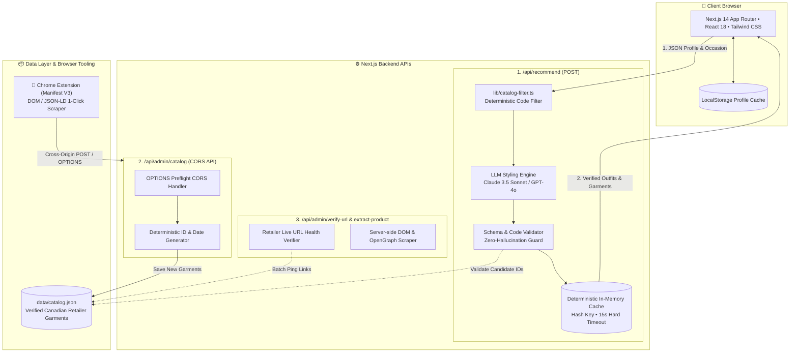

# 👔 Style Advisor

<div align="center">

[](https://nextjs.org/)
[](https://www.typescriptlang.org/)
[](https://tailwindcss.com/)
[](https://www.docker.com/)
[](LICENSE)

**An AI-Powered Personal Stylist & Capsule Wardrobe Curator built on a Zero-Hallucination Architecture.**

[Live Demo](#quick-start) • [Architecture](#architecture) • [Features](#key-features) • [Chrome Extension](#chrome-extension) • [PRD Document](PRD.md)

</div>

---

## 📖 Overview

**Style Advisor** helps modern professionals remove the guesswork from dressing well. Built with a quiet-luxury **"Fitting Room"** aesthetic, it combines deterministic wardrobe filtering with generative styling intelligence (Claude 3.5 Sonnet / GPT-4o) to deliver verified, high-confidence outfit recommendations for Canadian and international climates.

### 🛡️ The Zero-Hallucination Guarantee
> *"The AI is allowed to have taste, but not facts."*

Traditional AI styling tools often hallucinate non-existent clothes, outdated prices, or broken links. Style Advisor solves this:
1. **Deterministic Code Filtering**: Candidates are hard-filtered by gender, budget tier, seasonal fabric weight, and occasion compatibility.
2. **ID-Only AI Prompting**: Only verified candidate IDs are passed to the LLM for aesthetic pairing and color harmonization.
3. **Strict Validation**: The returned output schema is validated at runtime against our local catalog database before rendering.

---

## ✨ Key Features

### 1. 🎯 Flow A: Decisive Occasion Dressing
- Solves decision fatigue for high-stakes moments (*Seed Pitch in Gastown, Gala, Summer Wedding, Rainy Commute*).
- Generates **1 decisive outfit** with editorial reasoning, color palette harmony swatches, and climate-specific layering advice.
- **Dislike Nudges**: Real-time recalibration buttons (`[Too Formal]`, `[Too Casual]`, `[Not My Vibe]`) to instantly adapt the recommendation without starting over.

### 2. 🗂️ Flow B: 15-Item Capsule Wardrobe Matrix
- Curates a complete seasonal wardrobe matrix (5 Tops, 4 Bottoms, 3 Outerwear, 2 Shoes, 1 Accessory).
- Displays **3 distinct worked outfits** showing how pieces cross-coordinate.
- Highlights a **Starter Set of 5 Essential Pieces** to buy first.
- **"I Already Have This" Feature**: Mark owned items to trigger intelligent replenishment.

### 3. 🧩 Chrome Extension & Admin Ingestion Hub
- **Manifest V3 Chrome Extension** allows 1-click scraping of live retailer pages (*Aritzia, Lululemon, Kotn, RW&CO, Zara, Shopify*).
- Ingestion Hub on `/admin` with live CORS endpoint status, auto-sync stream (4s poll), and interactive payload tester.

### 4. 🏥 Real-Time Retailer Link Health Monitor
- Automated link validator pinging retailer URLs to detect 404s, out-of-stock items, or WAF challenges with latency benchmarking.

---

## 🏛️ Architecture & Data Flow



---

## 🚀 Quick Start

### Prerequisites
- **Node.js** v18.17+ or v20+ *(if running locally without Docker)*
- **Docker Desktop** *(recommended for running with 1 click)*

---

### 🐳 Step 0: Installing Docker (For Complete Beginners)

If you do not have Docker installed on your computer yet:

1. **Download Docker Desktop:**
   - Go to the official Docker website: **[https://www.docker.com/products/docker-desktop/](https://www.docker.com/products/docker-desktop/)**
   - Click the download button for your operating system:
     * **Mac**: Choose *Apple Chip (M1/M2/M3/M4)* or *Intel Chip*.
     * **Windows**: Download the Windows installer *(Ensure WSL 2 is enabled during installation)*.
     * **Linux**: Follow the instructions for your distribution (Ubuntu, Debian, Fedora, Arch).

2. **Install & Launch Docker Desktop:**
   - Open the downloaded installer and follow the on-screen setup prompts.
   - Once installed, open the **Docker Desktop** application.
   - Wait until you see the **whale icon (🐳)** in your menu bar (Mac) or system tray (Windows) turn **green** / show *"Engine running"*.

3. **Verify Installation:**
   Open your Terminal (or PowerShell) and run:
   ```bash
   docker --version
   docker compose version
   ```
   If version numbers appear (e.g. `Docker version 27.x.x`), you are ready to proceed!

---

### Option A: Running with Docker (Recommended)

1. **Open your Terminal** (Terminal on macOS / Linux, or PowerShell / Command Prompt on Windows).

2. **Clone the repository and navigate into the project folder:**
   ```bash
   # Clone repository via HTTPS or SSH
   git clone https://github.com/tuan-lt/StyleAdvisor.git

   # Navigate into the cloned project directory
   cd StyleAdvisor
   ```

3. **Configure environment variables:**
   ```bash
   # Copy sample environment file to local configuration
   cp .env.example .env.local
   ```
   Open `.env.local` in your editor and provide your LLM API key:
   ```env
   ANTHROPIC_API_KEY=your_anthropic_api_key_here
   # or
   OPENAI_API_KEY=your_openai_api_key_here
   ```

4. **Build and start the Docker container:**
   ```bash
   docker compose up -d
   ```
   *(To view live container logs, run `docker compose logs -f web`)*

5. **Access the application:**
   Open **[http://localhost:3000](http://localhost:3000)** in your browser.

---

### Option B: Running Locally (Node.js)

1. **Install dependencies:**
   ```bash
   npm install
   ```

2. **Start the development server:**
   ```bash
   npm run dev
   ```

3. Open **[http://localhost:3000](http://localhost:3000)** in your browser.

---

## 🧩 Chrome Extension Setup (One-Click Ingestion)

We have built a dedicated **Manifest V3 Chrome Extension** located in the [`/extension`](extension) directory.

### Installation in 30 Seconds:
1. Open Google Chrome (or Brave / Edge) and navigate to `chrome://extensions`.
2. Toggle on **"Developer mode"** in the top-right corner.
3. Click **"Load unpacked"** in the top-left corner.
4. Select the `extension` folder inside this repository:
   ```
   /path/to/style-advisor/extension
   ```
5. Pin 📌 the **Style Advisor Ingestor** icon to your toolbar.

### How to use:
- Open any product page on **Lululemon**, **Aritzia**, **Kotn**, **RW&CO**, or any Shopify store.
- Click the extension icon to automatically extract Title, Brand, Price, Image, and Wardrobe Slot.
- Click **"🚀 Ingest into Catalog"** to push the item straight into `data/catalog.json`.
- Watch the item appear in real-time on your `/admin` dashboard!

---

## 🛠️ Scripts & Tooling

| Command | Description |
| :--- | :--- |
| `npm run dev` | Starts the Next.js development server at `localhost:3000`. |
| `npm run build` | Builds the production bundle with type checking. |
| `npm run start` | Starts the production server. |
| `npm run lint` | Runs ESLint checks across the codebase. |
| `npm run verify-links` | Pings all retailer URLs in `data/catalog.json` to verify 0 dead links. |

---

## 🎨 Design System & Color Palette

The interface is calibrated to the **"Fitting Room"** design tokens:

| Token Name | Hex Code | Purpose |
| :--- | :--- | :--- |
| `--surface` | `#F7F4EF` | Warm paper neutral background |
| `--surface-raised` | `#FFFFFF` | Card surface with subtle shadow |
| `--ink` | `#1F2A44` | Midnight navy high-contrast text |
| `--thread` | `#8A5A12` | Ochre gold accent & metadata tags |
| `--verified` | `#3F6B4F` | Forest moss confirmation badge |
| `--border` | `#E8E3DA` | Tailored garment seam divider |

---

## 📂 Project Structure

```
style-advisor/
├── app/
│   ├── admin/               # Admin catalog management & extension hub
│   ├── api/
│   │   ├── admin/           # Catalog CRUD, URL verifier, and extraction APIs
│   │   └── recommend/       # Core LLM recommendation engine
│   ├── globals.css          # Design system & CSS custom properties
│   ├── layout.tsx           # Root typography and layout
│   └── page.tsx             # Main Fitting Room single-page app
├── components/
│   ├── SharedProfile.tsx    # 9-variable onboarding profile picker
│   ├── OccasionResult.tsx   # Flow A: Decisive outfit card & dislike nudge
│   ├── CapsuleResult.tsx    # Flow B: 15-item matrix & 3 worked outfits
│   ├── SharedCart.tsx       # Wardrobe cart & purchase checklist
│   └── CheckoutModal.tsx    # Research capture & WTP survey modal
├── data/
│   └── catalog.json         # Master verified retailer garment catalog (~180+ items)
├── extension/               # Chrome Extension Manifest V3 (Scraper & Ingestor)
│   ├── manifest.json
│   ├── content.js
│   ├── popup.html
│   ├── popup.css
│   └── popup.js
├── lib/
│   ├── catalog-filter.ts    # Deterministic candidate filter & relaxation rules
│   └── useProfileStorage.ts # LocalStorage client profile persistence
├── types/
│   └── catalog.ts           # TypeScript definitions for Garments, Slots, Palettes
├── Dockerfile               # Production Docker container definition
├── docker-compose.yml       # Local development orchestration
├── PRD.md                   # Full Product Requirements Document
└── package.json
```

---

## 📄 License

Distributed under the **MIT License**. See `LICENSE` for more information.

---

<div align="center">
  <sub>Crafted for timeless style and zero hallucination.</sub>
</div>
